> [!NOTE]
> **Island Survival 2.0 is live:** Rebuilt with rigged humanoid locomotion, real swimming & buoyancy physics, dynamic PBR multi-splat terrain & water shaders, astronomical day/night & weather cycles, modular crafting/building, and procedural Web Audio.

<div align="center">

# 🏝️ ISLAND SURVIVAL 3D

[](https://threejs.org/)
[](https://www.typescriptlang.org/)
[](https://rapier.rs/)
[](https://vitejs.dev/)
[](LICENSE)

### A realistic, third-person 3D tropical survival game built natively for the web.

Explore a procedurally generated tropical island, gather resources, craft survival tools, build shelters, swim through dynamic ocean waves, and endure the elements.

**Developed with ❤️ by [JOJIN JOHN](https://github.com/jojin1709)**

<p><strong>Quick Launch</strong></p>

```bash
git clone https://github.com/jojin1709/island-survival-3d-.git
cd island-survival-3d-
npm install
npm run dev
```

<sub>Open <code>http://localhost:5173/</code> in any modern WebGL2-compatible browser.</sub>

---

</div>

> [!TIP]
> **No backend or account required:** All player stats, world modifications, crafted tools, and shelter coordinates are automatically saved locally in your browser via `localStorage`.

---

## Table of Contents

- [Overview](#overview)
  - [Why Island Survival?](#why-island-survival)
  - [Key Highlights](#key-highlights)
- [Quick Start](#quick-start)
  - [Prerequisites](#prerequisites)
  - [Installation & Local Run](#installation--local-run)
  - [Production Build](#production-build)
- [Game Controls](#game-controls)
- [Key Features](#key-features)
  - [1. Humanoid Locomotion & Skeletal Animations](#1-humanoid-locomotion--skeletal-animations)
  - [2. True Swimming & Water Physics](#2-true-swimming--water-physics)
  - [3. Multi-Biome Island & PBR Shading](#3-multi-biome-island--pbr-shading)
  - [4. Dynamic Day/Night & Weather System](#4-dynamic-daynight--weather-system)
  - [5. Survival, Inventory & Crafting Station](#5-survival-inventory--crafting-station)
  - [6. Real-Time Building Placement System](#6-real-time-building-placement-system)
  - [7. Procedural Spatial Web Audio](#7-procedural-spatial-web-audio)
- [Architecture](#architecture)
- [Biomes & Landmarks](#biomes--landmarks)
- [Development & Debugging](#development--debugging)
- [Tech Stack](#tech-stack)
- [Author & Credits](#author--credits)
- [License](#license)

---

## Overview

**Island Survival** is a self-contained, high-performance third-person 3D survival game engineered from the ground up with Three.js, TypeScript, Vite, and Rapier3D physics. It demonstrates what is achievable with modern WebGL without relying on heavy third-party gaming engines.

<details>
<summary><strong>Why Island Survival?</strong></summary>

Most web-based 3D demos are simple static showcases or primitive geometry tests. **Island Survival** bridges the gap between browser demos and full indie survival games by implementing:
- Real humanoid skeletal animation state machines (Idle, Walk, Run, Sprint, Jump, Fall, Land, Swim, Dive).
- True camera-relative vector locomotion and Rapier3D physics.
- Realistic buoyant water volumes and wave displacement.
- Rich procedural PBR multi-splat shading that dynamically blends sand, lush jungle grass, and mountain granite based on altitude and slope.
- Zero server overhead — runs 100% client-side with 60 FPS target performance on standard hardware.

</details>

<details>
<summary><strong>Key Highlights</strong></summary>

- **Humanoid Survivor**: Rigged survivor model with athletic build, adventure attire, backpack, and smooth animation cross-fading.
- **True Swimming**: Buoyancy simulation, water drag, surface floatation, vertical swimming, diving, and smooth water entry/exit.
- **Trochoidal Ocean**: Custom GLSL vertex and fragment shaders with Fresnel reflections, solar glints, and shoreline foam.
- **Physical Collisions**: Rapier3D dynamic capsule controllers, trimesh terrain colliders, and static colliders for trees, boulders, and structures.
- **Procedural Soundscape**: Web Audio API synthesis generating ocean surf, wind, footsteps, bird ambience, and gathering SFX without external audio dependencies.

</details>

---

## Quick Start

### Prerequisites
- **Node.js**: `v18.0.0` or higher
- **npm**: `v9.0.0` or higher
- **Modern Web Browser**: Chrome, Edge, Firefox, or Safari with WebGL2 support

### Installation & Local Run

```bash
# 1. Clone the repository
git clone https://github.com/your-username/island-survival.git
cd island-survival

# 2. Install dependencies
npm install

# 3. Start the Vite dev server
npm run dev
```

Visit `http://localhost:5173/` in your browser and click **ENTER ISLAND**.

### Production Build

```bash
# Type check and compile optimized static bundle
npm run build

# Preview production build locally
npm run preview
```

---

## Game Controls

| Action | Keybinding | Description |
|---|---|---|
| **Move / Swim** | <kbd>W</kbd> <kbd>A</kbd> <kbd>S</kbd> <kbd>D</kbd> | Camera-relative movement (W always moves away from camera) |
| **Sprint / Fast Swim** | <kbd>Shift</kbd> + <kbd>WASD</kbd> | Accelerates movement speed (consumes Stamina) |
| **Jump / Swim Up** | <kbd>Space</kbd> | Jump on land / Ascend to surface in water |
| **Dive Down** | <kbd>X</kbd> or <kbd>Ctrl</kbd> | Submerge and swim downwards in water |
| **Interact / Harvest** | <kbd>E</kbd> | Chop trees, mine rocks, pick berries, drink water |
| **Orbit Camera** | `Mouse Move` | Free camera rotation around player |
| **Zoom Camera** | `Mouse Wheel` | Adjust third-person follow distance (1.8m – 8.5m) |
| **Hotbar Slots** | <kbd>1</kbd> – <kbd>6</kbd> | Quick-select tools, food, or building blueprints |
| **Inventory** | <kbd>I</kbd> | Open 24-slot inventory grid & carrying weight |
| **Crafting** | <kbd>C</kbd> | Open survival crafting workshop |
| **Building Mode** | <kbd>B</kbd> | Toggle ghost blueprint placement mode |
| **Rotate Blueprint** | <kbd>R</kbd> | Rotate structure ghost by 45° |
| **Place Structure** | `Left Click` | Confirm blueprint placement on valid terrain |
| **Debug Overlay** | <kbd>F3</kbd> | Toggle developer vectors & physics telemetry |
| **Release Mouse** | <kbd>Esc</kbd> | Exit pointer lock & close all active modals |

---

## Key Features

### 1. Humanoid Locomotion & Skeletal Animations
* Human survivor model with natural proportions, adventure clothing, and backpack.
* 11 blended animation states: `IDLE`, `WALK`, `RUN`, `SPRINT`, `JUMP`, `FALL`, `LAND`, `SWIM`, `SWIM_IDLE`, `WATER_ENTER`, `WATER_EXIT`.
* Strict horizontal camera-relative vector math — human character always faces the true direction of travel with smooth angular interpolation.

### 2. True Swimming & Water Physics
* Real water gameplay volumes differentiating **Ground**, **Shallow Wading**, **Surface Swimming**, and **Underwater Diving**.
* Buoyant upward forces counterbalance gravity near the water line ($y \approx -0.4\text{m}$).
* Surface float locking, water drag damping, and vertical swim controls (<kbd>Space</kbd> to ascend, <kbd>X</kbd> to dive).

### 3. Multi-Biome Island & PBR Shading
* 220m island terrain generated via multi-octave Perlin/Simplex noise.
* Custom multi-splat PBR shader dynamically blending beach sand, fertile jungle grass, and granite mountain rock based on altitude and slope angle.
* High-precision Rapier3D trimesh physics collision.

### 4. Dynamic Day/Night & Weather System
* Astronomical solar arc with realistic sun movement, golden hour sunsets, and starlit night skies with pale moonlight.
* Dynamic weather system: `Clear`, `Overcast`, and `Rainstorm` with falling rain particle simulations, wind slant, and thunder flashes.

### 5. Survival, Inventory & Crafting Station
* **Vitals Simulation**: Health (❤️), Hunger (🍖), Thirst (💧), and Stamina (⚡).
* **Inventory Management**: 24-slot grid with stack counts, item weights, and a 6-slot active Hotbar.
* **Crafting Tree**: Stone Hatchet, Stone Pickaxe, Hunting Spear, Fiber Torch, Campfire, Lean-To Shelter, and Dew Water Collector.

### 6. Real-Time Building Placement System
* Real-time ghost blueprint projection with terrain slope validation (Green = valid, Red = invalid).
* Snaps to terrain elevation, rotates in 45° increments (<kbd>R</kbd>), and spawns persistent Rapier colliders upon placement.

### 7. Procedural Spatial Web Audio
* Web Audio API synthesis generating ocean surf, dynamic wind, forest birds, night crickets, surface footsteps (sand, grass, water), and chopping/mining SFX.

---

## Architecture

```mermaid
flowchart TD
    MAIN["main.ts (Game Loop)"] --> PHYS["PhysicsWorld (Rapier3D)"]
    MAIN --> TERRAIN["TerrainGenerator + Multi-Splat PBR"]
    MAIN --> WATER["WaterMesh + WaterVolume"]
    MAIN --> SKY["SkyAtmosphere + Day/Night"]
    MAIN --> PLAYER["HumanSurvivorModel + CharacterController"]
    MAIN --> CAM["ThirdPersonCamera (Orbit & Occlusion)"]
    MAIN --> ENV["VegetationManager + RockManager + PropManager"]
    MAIN --> SURVIVAL["SurvivalStats (Health, Hunger, Thirst, Stamina)"]
    MAIN --> INV["InventoryManager + CraftingManager"]
    MAIN --> BUILD["BuildingManager + BuildingPlacer"]
    MAIN --> AUDIO["SynthesizedAudio (Web Audio API)"]
    MAIN --> UI["UIManager (HUD, Inventory, Crafting, Toasts)"]
```



```
src/
├── assets/
│   └── AssetManager.ts          # Centralized GLTF & procedural PBR texture loader
├── game/
│   ├── audio/
│   │   └── SynthesizedAudio.ts  # Web Audio API spatial ocean, wind & SFX synthesis
│   ├── building/
│   │   ├── BuildingManager.ts   # Persistent structures & colliders
│   │   └── BuildingPlacer.ts    # Ghost blueprint preview & terrain validation
│   ├── camera/
│   │   └── ThirdPersonCamera.ts # Smooth orbit, shoulder offset & collision raycasting
│   ├── crafting/
│   │   ├── CraftingManager.ts   # Crafting validation & output
│   │   └── RecipeRegistry.ts    # Recipe definitions
│   ├── environment/
│   │   ├── PropManager.ts       # Shipwreck, sea cave, driftwood, springs
│   │   ├── RockManager.ts       # Granite boulders & mineable nodes
│   │   ├── SkyAtmosphere.ts     # Solar arc, lighting, shadows, stars & clouds
│   │   ├── VegetationManager.ts # Palms, hardwoods, bushes & instanced grass
│   │   ├── WaterMesh.ts         # Trochoidal wave ocean & lagoon shaders
│   │   └── WaterVolume.ts       # Water submersion & swimming state detection
│   ├── interaction/
│   │   └── InteractionManager.ts# Proximity & raycast gathering detection
│   ├── inventory/
│   │   ├── InventoryManager.ts  # 24-slot inventory, hotbar & stacking
│   │   └── ItemRegistry.ts      # Item definitions, weights, consumables
│   ├── physics/
│   │   └── PhysicsWorld.ts      # Rapier3D physics world & colliders
│   ├── player/
│   │   ├── AnimationController.ts # 11-state skeletal animation state machine
│   │   ├── CharacterController.ts # Ground & swimming movement physics
│   │   └── HumanSurvivorModel.ts  # Rigged human survivor mesh & bones
│   ├── save/
│   │   └── SaveManager.ts       # LocalStorage game state persistence
│   ├── survival/
│   │   └── SurvivalStats.ts     # Health, hunger, thirst, stamina simulation
│   ├── terrain/
│   │   ├── TerrainGenerator.ts  # 220m procedural heightmap & trimesh collider
│   │   └── TerrainMaterial.ts   # Multi-splat PBR slope & altitude shader
│   ├── time/
│   │   └── DayNightCycle.ts     # Astronomical solar time progression
│   ├── ui/
│   │   ├── BuildingUI.ts        # Placement hotkey guide
│   │   ├── CraftingUI.ts        # Crafting recipe workshop modal
│   │   ├── HUD.ts               # Minimalist status meters, compass tape & hotbar
│   │   ├── InventoryUI.ts       # 24-slot grid modal & tooltips
│   │   ├── ToastUI.ts           # Non-intrusive notifications
│   │   └── UIManager.ts         # UI coordinator
│   ├── weather/
│   │   └── WeatherManager.ts    # Clear, cloudy, rainstorm particle engine
│   └── world/
│       └── IslandZones.ts       # Zone definitions & landmark coordinates
├── main.ts                      # Main game bootstrap & render loop
└── style.css                    # Modern minimalist survival HUD styling
```

---

## Biomes & Landmarks

| Landmark | Coordinates | Description |
|---|---|---|
| **Survivor Beach** | `(0, 0.8, 48)` | White sand spawning shore with driftwood and salvage crates |
| **Dense Palm Jungle** | `(0, 5.5, 0)` | Central forest with coconut palms, hardwoods, and berry bushes |
| **Eagle Ridge & Cliffs** | `(-15, 18.0, -35)` | Towering 24m granite cliffs with panoramic ocean views |
| **Freshwater Oasis** | `(32, 1.2, -8)` | Secluded freshwater lagoon with harvestable drinking water |
| **Shipwreck Cove** | `(-38, 1.0, 36)` | Stranded trading vessel hull with salvageable cargo crates |
| **Smuggler Cave** | `(-46, 2.5, 8)` | Rocky cavern entrance hollowed into the western cliffs |

---

## Development & Debugging

Press <kbd>F3</kbd> in-game to toggle the **Controller Debug Overlay**:
* **Telemetry**: Real-time position, linear velocity, facing yaw, grounded status, water state, and animation state.
* **3D Direction Vectors**:
  * 🔵 **Blue Arrow**: Camera Horizontal Forward Vector
  * 🟢 **Green Arrow**: Human Player Facing Vector
  * 🔴 **Red Arrow**: Active Movement Input Vector

---

## Tech Stack

* **3D Graphics**: [Three.js](https://threejs.org/) (WebGL2, PCFSoftShadowMap, ACESFilmicToneMapping)
* **Physics Engine**: [@dimforge/rapier3d-compat](https://rapier.rs/) (WebAssembly Rapier3D)
* **Language**: [TypeScript](https://www.typescriptlang.org/) (Strict Mode)
* **Build Tool**: [Vite](https://vitejs.dev/)
* **Audio**: Native [Web Audio API](https://developer.mozilla.org/en-US/docs/Web/API/Web_Audio_API)
* **Styling**: Vanilla CSS (Modern Glassmorphism & Minimal Survival Aesthetic)

---

## Author & Credits

**Developed by JOJIN JOHN**
* **GitHub**: [@your-username](https://github.com/)
* **Project**: Island Survival 3D

---

## License

This project is licensed under the [MIT License](LICENSE) — free for personal, educational, and commercial use.
